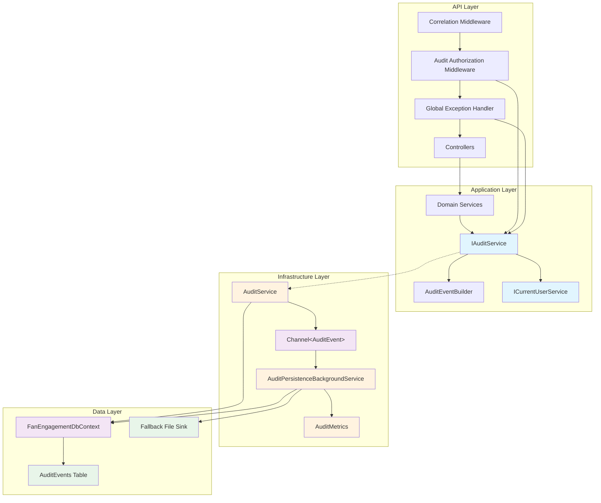
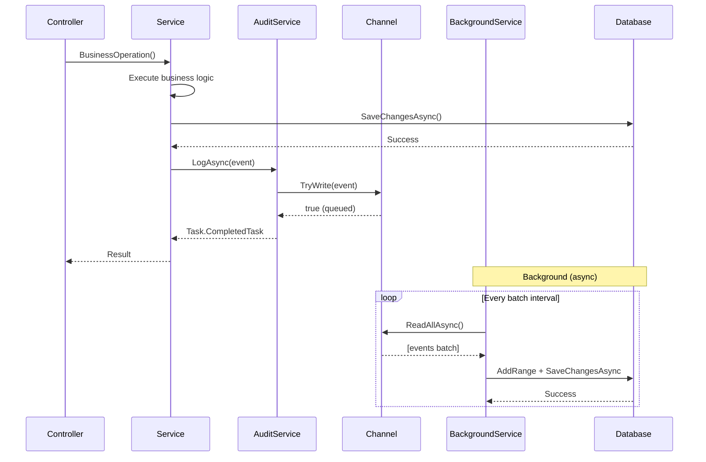
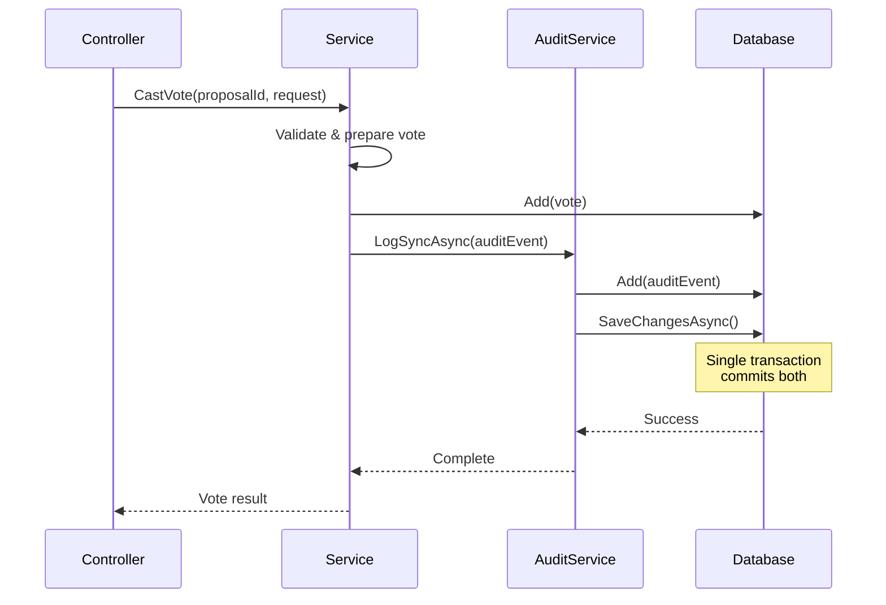
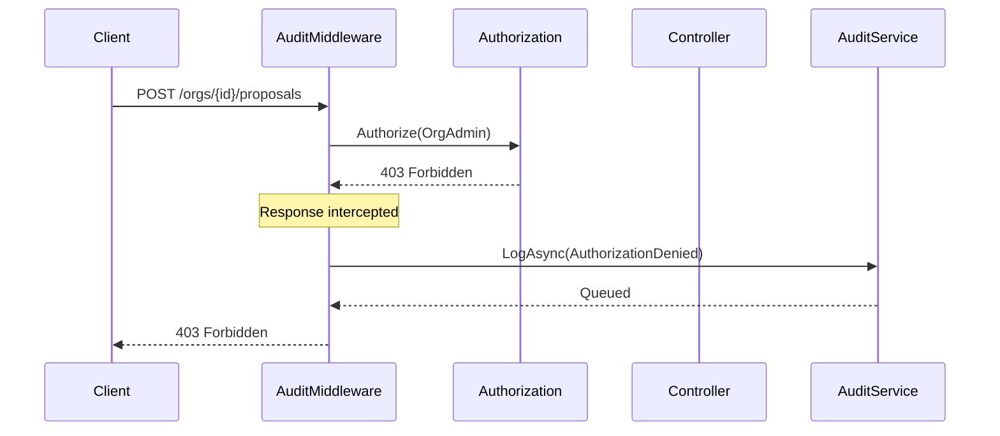
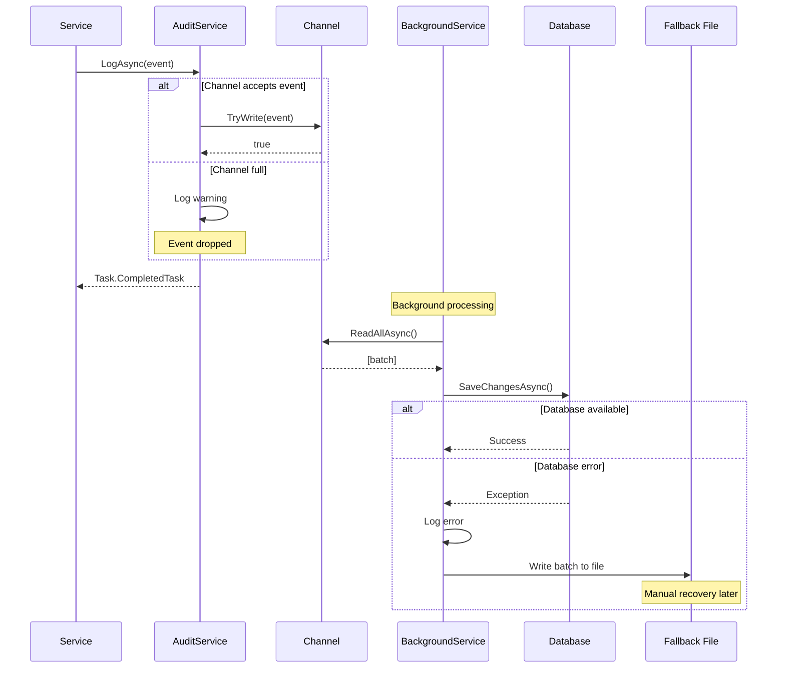

# Audit Service Architecture

> **Document Type:** Architecture Design  
> **Epic:** E-005 - Implement Thorough Audit Logging Across the Application  
> **Issue:** E-005-02  
> **Status:** Complete  
> **Last Updated:** November 28, 2024  
> **Depends On:** E-005-01 (Audit Data Model)  
> **Dependency For:** E-005-05 (Audit Service Implementation)

## Executive Summary

This document defines the audit service architecture for FanEngagement, establishing a well-encapsulated, minimally invasive, and performant approach to audit logging. The design prioritizes:

1. **Non-blocking Operations**: Audit logging must never fail or slow down business operations
2. **Flexible Integration**: Support both explicit service calls and automatic middleware-based capture
3. **Developer Experience**: Fluent API for easy event construction with compile-time safety
4. **Existing Pattern Alignment**: Build on established patterns like `IOutboundEventService` and background workers

**Recommendation Summary:**

- **Primary Approach**: Hybrid synchronous + asynchronous with channel-based buffering
- **Integration**: Combination of explicit service calls and automatic middleware/interceptor capture
- **Error Handling**: Fail-safe with logging and silent degradation; never impact business operations

---

## Table of Contents

1. [IAuditService Interface Definition](#1-iauditservice-interface-definition)
2. [AuditEventBuilder Fluent API](#2-auditeventbuilder-fluent-api)
3. [Synchronous vs. Asynchronous Logging](#3-synchronous-vs-asynchronous-logging)
4. [Integration Points](#4-integration-points)
5. [Error Handling Strategy](#5-error-handling-strategy)
6. [Component Architecture](#6-component-architecture)
7. [Sequence Diagrams](#7-sequence-diagrams)
8. [Configuration](#8-configuration)
9. [Implementation Guidelines](#9-implementation-guidelines)
10. [Testing Strategy](#10-testing-strategy)

---

## 1. IAuditService Interface Definition

### 1.1 Core Interface

The `IAuditService` interface provides the primary contract for audit logging throughout the application.

```csharp
namespace FanEngagement.Application.Audit;

/// <summary>
/// Service for capturing and querying audit events.
/// Audit logging is fail-safe—failures are logged but never propagate to callers.
/// </summary>
public interface IAuditService
{
    /// <summary>
    /// Logs an audit event. This method is fire-and-forget by default.
    /// The event is queued for asynchronous persistence.
    /// </summary>
    /// <param name="auditEvent">The audit event to log.</param>
    /// <param name="cancellationToken">Cancellation token.</param>
    /// <returns>Task that completes when the event is queued (not persisted).</returns>
    Task LogAsync(AuditEvent auditEvent, CancellationToken cancellationToken = default);

    /// <summary>
    /// Logs an audit event using a fluent builder. This method is fire-and-forget by default.
    /// </summary>
    /// <param name="builder">The audit event builder with configured properties.</param>
    /// <param name="cancellationToken">Cancellation token.</param>
    /// <returns>Task that completes when the event is queued (not persisted).</returns>
    Task LogAsync(AuditEventBuilder builder, CancellationToken cancellationToken = default);

    /// <summary>
    /// Logs an audit event synchronously within the current database transaction.
    /// Use this for critical audit events that must be atomically committed with business data.
    /// </summary>
    /// <param name="auditEvent">The audit event to log.</param>
    /// <param name="cancellationToken">Cancellation token.</param>
    /// <returns>Task that completes when the event is persisted.</returns>
    Task LogSyncAsync(AuditEvent auditEvent, CancellationToken cancellationToken = default);

    /// <summary>
    /// Queries audit events with filtering and pagination.
    /// </summary>
    /// <param name="query">Query parameters including filters and pagination.</param>
    /// <param name="cancellationToken">Cancellation token.</param>
    /// <returns>Paged result of audit events.</returns>
    Task<PagedResult<AuditEventDto>> QueryAsync(
        AuditQuery query, 
        CancellationToken cancellationToken = default);

    /// <summary>
    /// Gets a single audit event by ID.
    /// </summary>
    /// <param name="id">The audit event ID.</param>
    /// <param name="cancellationToken">Cancellation token.</param>
    /// <returns>The audit event or null if not found.</returns>
    Task<AuditEventDto?> GetByIdAsync(
        Guid id, 
        CancellationToken cancellationToken = default);
}
```

### 1.2 Query Parameters

```csharp
namespace FanEngagement.Application.Audit;

/// <summary>
/// Query parameters for audit event retrieval.
/// </summary>
public class AuditQuery
{
    /// <summary>
    /// Filter by organization. Required for OrgAdmin queries; optional for GlobalAdmin.
    /// </summary>
    public Guid? OrganizationId { get; set; }

    /// <summary>
    /// Filter by the user who performed the action.
    /// </summary>
    public Guid? ActorUserId { get; set; }

    /// <summary>
    /// Filter by action type (Created, Updated, Deleted, etc.).
    /// </summary>
    public ActionType? ActionType { get; set; }

    /// <summary>
    /// Filter by resource type (User, Organization, Proposal, etc.).
    /// </summary>
    public ResourceType? ResourceType { get; set; }

    /// <summary>
    /// Filter by specific resource ID.
    /// </summary>
    public Guid? ResourceId { get; set; }

    /// <summary>
    /// Filter by outcome (Success, Failure, Denied).
    /// </summary>
    public Outcome? Outcome { get; set; }

    /// <summary>
    /// Filter events from this date/time (inclusive).
    /// </summary>
    public DateTime? FromDate { get; set; }

    /// <summary>
    /// Filter events until this date/time (inclusive).
    /// </summary>
    public DateTime? ToDate { get; set; }

    /// <summary>
    /// Search text for resource name or actor display name.
    /// </summary>
    public string? SearchText { get; set; }

    /// <summary>
    /// Page number (1-based).
    /// </summary>
    public int Page { get; set; } = 1;

    /// <summary>
    /// Page size (default 50, max 100).
    /// </summary>
    public int PageSize { get; set; } = 50;

    /// <summary>
    /// Sort order: "asc" or "desc" (default: "desc" by timestamp).
    /// </summary>
    public string SortOrder { get; set; } = "desc";
}
```

### 1.3 DTOs

```csharp
namespace FanEngagement.Application.Audit;

/// <summary>
/// Audit event DTO for query results.
/// </summary>
public record AuditEventDto(
    Guid Id,
    DateTime Timestamp,
    Guid? ActorUserId,
    string? ActorDisplayName,
    string? ActorIpAddress,
    ActionType ActionType,
    Outcome Outcome,
    string? FailureReason,
    ResourceType ResourceType,
    Guid ResourceId,
    string? ResourceName,
    Guid? OrganizationId,
    string? OrganizationName,
    string? CorrelationId
);

/// <summary>
/// Detailed audit event DTO including the Details JSON.
/// </summary>
public record AuditEventDetailsDto(
    Guid Id,
    DateTime Timestamp,
    Guid? ActorUserId,
    string? ActorDisplayName,
    string? ActorIpAddress,
    ActionType ActionType,
    Outcome Outcome,
    string? FailureReason,
    ResourceType ResourceType,
    Guid ResourceId,
    string? ResourceName,
    Guid? OrganizationId,
    string? OrganizationName,
    string? Details,  // JSON string
    string? CorrelationId
);
```

---

## 2. AuditEventBuilder Fluent API

### 2.1 Builder Design

The `AuditEventBuilder` provides a fluent API for constructing audit events with compile-time safety and clear intent.

```csharp
namespace FanEngagement.Application.Audit;

/// <summary>
/// Fluent builder for constructing audit events.
/// </summary>
public class AuditEventBuilder
{
    private readonly AuditEvent _event;

    public AuditEventBuilder()
    {
        _event = new AuditEvent
        {
            Id = Guid.NewGuid(),
            Timestamp = DateTime.UtcNow,
            Outcome = Outcome.Success
        };
    }

    /// <summary>
    /// Sets the actor (user performing the action).
    /// </summary>
    public AuditEventBuilder WithActor(Guid userId, string displayName)
    {
        _event.ActorUserId = userId;
        _event.ActorDisplayName = displayName;
        return this;
    }

    /// <summary>
    /// Sets the actor from an HttpContext (extracts user claims and IP).
    /// </summary>
    public AuditEventBuilder WithActor(HttpContext context)
    {
        // Extract user ID from claims
        var userIdClaim = context.User.FindFirst(ClaimTypes.NameIdentifier);
        if (userIdClaim != null && Guid.TryParse(userIdClaim.Value, out var userId))
        {
            _event.ActorUserId = userId;
        }

        // Extract display name from claims
        var nameClaim = context.User.FindFirst(ClaimTypes.Name) 
            ?? context.User.FindFirst("display_name");
        _event.ActorDisplayName = nameClaim?.Value;

        // Extract IP address
        _event.ActorIpAddress = context.Connection.RemoteIpAddress?.ToString();

        return this;
    }

    /// <summary>
    /// Sets the actor IP address.
    /// </summary>
    public AuditEventBuilder WithIpAddress(string? ipAddress)
    {
        _event.ActorIpAddress = ipAddress;
        return this;
    }

    /// <summary>
    /// Sets the action type.
    /// </summary>
    public AuditEventBuilder WithAction(ActionType actionType)
    {
        _event.ActionType = actionType;
        return this;
    }

    /// <summary>
    /// Sets the resource being acted upon.
    /// </summary>
    public AuditEventBuilder WithResource(ResourceType resourceType, Guid resourceId, string? resourceName = null)
    {
        _event.ResourceType = resourceType;
        _event.ResourceId = resourceId;
        _event.ResourceName = resourceName;
        return this;
    }

    /// <summary>
    /// Sets the organization context.
    /// </summary>
    public AuditEventBuilder WithOrganization(Guid organizationId, string? organizationName = null)
    {
        _event.OrganizationId = organizationId;
        _event.OrganizationName = organizationName;
        return this;
    }

    /// <summary>
    /// Sets the outcome to success (default).
    /// </summary>
    public AuditEventBuilder AsSuccess()
    {
        _event.Outcome = Outcome.Success;
        _event.FailureReason = null;
        return this;
    }

    /// <summary>
    /// Sets the outcome to failure with a reason.
    /// </summary>
    public AuditEventBuilder AsFailure(string reason)
    {
        _event.Outcome = Outcome.Failure;
        _event.FailureReason = TruncateReason(reason);
        return this;
    }

    /// <summary>
    /// Sets the outcome to denied (authorization failure) with a reason.
    /// </summary>
    public AuditEventBuilder AsDenied(string reason)
    {
        _event.Outcome = Outcome.Denied;
        _event.FailureReason = TruncateReason(reason);
        return this;
    }

    /// <summary>
    /// Sets the outcome to partial success with details.
    /// </summary>
    public AuditEventBuilder AsPartial(string details)
    {
        _event.Outcome = Outcome.Partial;
        _event.FailureReason = TruncateReason(details);
        return this;
    }

    /// <summary>
    /// Sets the correlation ID for request tracing.
    /// </summary>
    public AuditEventBuilder WithCorrelationId(string correlationId)
    {
        _event.CorrelationId = correlationId;
        return this;
    }

    /// <summary>
    /// Sets additional structured details as a JSON object.
    /// </summary>
    public AuditEventBuilder WithDetails(object details)
    {
        _event.Details = JsonSerializer.Serialize(details, JsonSerializerOptions);
        return this;
    }

    /// <summary>
    /// Sets additional details as raw JSON string.
    /// </summary>
    public AuditEventBuilder WithDetailsJson(string detailsJson)
    {
        // Parse the JSON string to an object
        var detailsObj = JsonSerializer.Deserialize<Dictionary<string, object>>(detailsJson, JsonSerializerOptions);
        // Redact sensitive fields
        if (SensitiveFieldsToRedact != null)
        {
            foreach (var field in SensitiveFieldsToRedact)
            {
                if (detailsObj.ContainsKey(field))
                {
                    detailsObj[field] = "***REDACTED***";
                }
            }
        }
        // Serialize back to JSON and store
        _event.Details = JsonSerializer.Serialize(detailsObj, JsonSerializerOptions);
        return this;
    }

    /// <summary>
    /// Builds the audit event.
    /// </summary>
    public AuditEvent Build()
    {
        ValidateRequiredFields();
        return _event;
    }

    private void ValidateRequiredFields()
    {
        if (_event.ActionType == default)
            throw new InvalidOperationException("ActionType is required.");
        if (_event.ResourceType == default)
            throw new InvalidOperationException("ResourceType is required.");
        if (_event.ResourceId == Guid.Empty)
            throw new InvalidOperationException("ResourceId is required.");
    }

    private static string? TruncateReason(string? reason)
    {
        const int MaxLength = 1000;
        const string TruncationSuffix = "...[truncated]";
        if (string.IsNullOrEmpty(reason)) return reason;
        if (reason.Length <= MaxLength) return reason;
        // Truncate and append indicator to show message was cut off
        return reason[..(MaxLength - TruncationSuffix.Length)] + TruncationSuffix;
    }

    private static readonly JsonSerializerOptions JsonSerializerOptions = new()
    {
        PropertyNamingPolicy = JsonNamingPolicy.CamelCase,
        WriteIndented = false
    };
}
```

### 2.2 Usage Examples

```csharp
// Example 1: Simple audit event
await auditService.LogAsync(
    new AuditEventBuilder()
        .WithActor(userId, "Alice Admin")
        .WithAction(ActionType.Created)
        .WithResource(ResourceType.Proposal, proposalId, "Q4 Budget Proposal")
        .WithOrganization(orgId, "Manchester United FC")
        .AsSuccess());

// Example 2: With HTTP context and details
await auditService.LogAsync(
    new AuditEventBuilder()
        .WithActor(httpContext)
        .WithAction(ActionType.StatusChanged)
        .WithResource(ResourceType.Proposal, proposalId, proposal.Title)
        .WithOrganization(proposal.OrganizationId, org.Name)
        .WithDetails(new {
            PreviousStatus = "Draft",
            NewStatus = "Open",
            EligibleVotingPower = 15000.0m
        })
        .WithCorrelationId(correlationId)
        .AsSuccess());

// Example 3: Authorization denied
await auditService.LogAsync(
    new AuditEventBuilder()
        .WithActor(httpContext)
        .WithAction(ActionType.AuthorizationDenied)
        .WithResource(ResourceType.Organization, orgId, org.Name)
        .WithDetails(new {
            Endpoint = "/organizations/{orgId}/proposals",
            Method = "POST",
            RequiredRole = "OrgAdmin",
            ActualRole = "Member"
        })
        .AsDenied("User lacks OrgAdmin role for this organization"));
```

---

## 3. Synchronous vs. Asynchronous Logging

### 3.1 Options Analysis

| Aspect | Option A: Synchronous | Option B: Asynchronous | Option C: Hybrid (Recommended) |
|--------|----------------------|------------------------|--------------------------------|
| **Description** | Write audit event directly to database within same transaction | Queue event to in-memory channel; background worker persists | Async by default with sync option for critical events |
| **Consistency** | Strong (same transaction) | Eventual (may lose events on crash) | Configurable per event type |
| **Performance** | Higher latency (~5-10ms per audit) | Minimal latency (~<1ms to queue) | Best of both |
| **Failure Impact** | Risk of failing business operation | None to business operation | None (async) or controlled (sync) |
| **Ordering** | Strict | Approximate | Strict for sync, approximate for async |
| **Implementation** | Simple | Requires background service | Moderate complexity |

### 3.2 Recommendation: Hybrid Approach (Option C)

**Primary Mode: Asynchronous with Channel-Based Buffering**

For the majority of audit events, use asynchronous logging:

1. Audit event is submitted to an in-memory `System.Threading.Channels.Channel<AuditEvent>`
2. `LogAsync()` returns immediately after queueing
3. `AuditPersistenceBackgroundService` reads from channel and persists in batches
4. Batching improves throughput (100 events/batch typical)

**Secondary Mode: Synchronous for Critical Events**

For events where atomicity with business data is essential:

1. Use `LogSyncAsync()` explicitly
2. Audit event is persisted immediately
3. Can participate in same database transaction as business operation
4. Examples: Vote cast, proposal status changes, role changes

### 3.3 Tradeoffs Summary

| Concern | Async (Default) | Sync (Optional) |
|---------|-----------------|-----------------|
| **Use When** | Most audit events | Critical governance events |
| **Data Loss Risk** | Small window on crash | None |
| **Performance Impact** | Negligible | ~5-10ms per event |
| **Transaction Participation** | No | Yes |
| **Failure Handling** | Silent logging | Configurable (fail-safe by default) |

### 3.4 Implementation Pattern

```csharp
public class AuditService : IAuditService
{
    private readonly Channel<AuditEvent> _channel;
    private readonly FanEngagementDbContext _dbContext;
    private readonly ILogger<AuditService> _logger;

    // Async (default): Queue to channel for background processing
    public Task LogAsync(AuditEvent auditEvent, CancellationToken ct = default)
    {
        try
        {
            // TryWrite is non-blocking; returns false if channel is full
            if (!_channel.Writer.TryWrite(auditEvent))
            {
                _logger.LogWarning(
                    "Audit channel full. Event dropped: {ActionType} on {ResourceType}/{ResourceId}",
                    auditEvent.ActionType, auditEvent.ResourceType, auditEvent.ResourceId);
            }
        }
        catch (Exception ex)
        {
            // Never propagate audit failures to caller
            _logger.LogError(ex, "Failed to queue audit event");
        }
        return Task.CompletedTask;
    }

    // Sync: Persist immediately (for critical events)
    public async Task LogSyncAsync(AuditEvent auditEvent, CancellationToken ct = default)
    {
        try
        {
            _dbContext.AuditEvents.Add(auditEvent);
            await _dbContext.SaveChangesAsync(ct);
        }
        catch (Exception ex)
        {
            // Log but don't propagate
            _logger.LogError(ex, 
                "Failed to persist sync audit event: {ActionType} on {ResourceType}/{ResourceId}",
                auditEvent.ActionType, auditEvent.ResourceType, auditEvent.ResourceId);
        }
    }
}
```

---

## 4. Integration Points

### 4.1 Integration Strategy Overview

The audit system integrates at multiple layers to provide comprehensive coverage:

```
┌─────────────────────────────────────────────────────────────────────┐
│                           API Layer                                  │
│  ┌─────────────────┐  ┌─────────────────┐  ┌─────────────────┐     │
│  │ CorrelationId   │→ │ AuditMiddleware │→ │   Controllers   │     │
│  │   Middleware    │  │ (auto-capture)  │  │ (explicit calls)│     │
│  └─────────────────┘  └─────────────────┘  └─────────────────┘     │
└─────────────────────────────────────────────────────────────────────┘
                                    │
                                    ▼
┌─────────────────────────────────────────────────────────────────────┐
│                        Application Layer                             │
│  ┌─────────────────┐  ┌─────────────────┐  ┌─────────────────┐     │
│  │ Authorization   │  │   Services      │  │  IAuditService  │     │
│  │   Handlers      │  │ (explicit calls)│  │    Interface    │     │
│  │ (auto-capture)  │  │                 │  │                 │     │
│  └─────────────────┘  └─────────────────┘  └─────────────────┘     │
└─────────────────────────────────────────────────────────────────────┘
                                    │
                                    ▼
┌─────────────────────────────────────────────────────────────────────┐
│                      Infrastructure Layer                            │
│  ┌─────────────────┐  ┌─────────────────┐  ┌─────────────────┐     │
│  │  AuditService   │→ │ Channel<Audit>  │→ │  Background     │     │
│  │ Implementation  │  │    Buffer       │  │    Worker       │     │
│  └─────────────────┘  └─────────────────┘  └─────────────────┘     │
└─────────────────────────────────────────────────────────────────────┘
                                    │
                                    ▼
┌─────────────────────────────────────────────────────────────────────┐
│                         PostgreSQL                                   │
│                     ┌─────────────────┐                             │
│                     │  AuditEvents    │                             │
│                     │     Table       │                             │
│                     └─────────────────┘                             │
└─────────────────────────────────────────────────────────────────────┘
```

### 4.2 Automatic Capture Points

#### 4.2.1 Authorization Failure Middleware

Captures all authorization failures (403 responses) automatically.

```csharp
public class AuditAuthorizationMiddleware
{
    private readonly RequestDelegate _next;
    private readonly ILogger<AuditAuthorizationMiddleware> _logger;

    public async Task InvokeAsync(HttpContext context, IAuditService auditService)
    {
        await _next(context);

        // Capture 403 Forbidden responses
        if (context.Response.StatusCode == StatusCodes.Status403Forbidden)
        {
            // Generate a deterministic ResourceId for system events based on endpoint
            // This ensures consistent tracking while avoiding Guid.Empty issues
            var resourceId = GenerateDeterministicGuid($"authz-denied:{context.Request.Path}:{context.Request.Method}");
            
            await auditService.LogAsync(
                new AuditEventBuilder()
                    .WithActor(context)
                    .WithAction(ActionType.AuthorizationDenied)
                    .WithResource(ResourceType.SystemConfiguration, resourceId, context.Request.Path)
                    .WithDetails(new {
                        Endpoint = context.Request.Path.Value,
                        Method = context.Request.Method,
                        StatusCode = 403
                    })
                    .WithCorrelationId(GetCorrelationId(context))
                    .AsDenied("Authorization denied"));
        }
    }
    
    /// <summary>
    /// Generates a deterministic GUID from a string for consistent system event tracking.
    /// Uses SHA-256 for collision resistance (takes first 16 bytes of hash).
    /// </summary>
    private static Guid GenerateDeterministicGuid(string input)
    {
        using var sha256 = System.Security.Cryptography.SHA256.Create();
        var hash = sha256.ComputeHash(System.Text.Encoding.UTF8.GetBytes(input));
        // Use the first 16 bytes of the SHA-256 hash to construct the GUID
        var guidBytes = new byte[16];
        Array.Copy(hash, guidBytes, 16);
        return new Guid(guidBytes);
    }
    
    /// <summary>
    /// Extracts the correlation ID from the response headers.
    /// </summary>
    private static string? GetCorrelationId(HttpContext context)
    {
        return context.Response.Headers["X-Correlation-ID"].FirstOrDefault();
    }
}
```

**Placement:** After authorization middleware, before controllers.

#### 4.2.2 Global Exception Handler Enhancement

Enhance existing `GlobalExceptionHandlerMiddleware` to capture error audit events.

```csharp
// In GlobalExceptionHandlerMiddleware
catch (Exception ex)
{
    // Existing error handling...
    
    // Add audit event for server errors
    if (statusCode >= 500)
    {
        // Generate deterministic GUID for system events
        var resourceId = GenerateDeterministicGuid($"error:{context.Request.Path}:{context.Request.Method}");
        
        await auditService.LogAsync(
            new AuditEventBuilder()
                .WithActor(context)
                .WithAction(ActionType.Accessed)
                .WithResource(ResourceType.SystemConfiguration, resourceId, context.Request.Path)
                .WithDetails(new {
                    Endpoint = context.Request.Path.Value,
                    Method = context.Request.Method,
                    ExceptionType = ex.GetType().Name,
                    // Don't include full message for security
                    ErrorCategory = "ServerError"
                })
                .WithCorrelationId(GetCorrelationId(context))
                .AsFailure($"Server error: {ex.GetType().Name}"));
    }
}
```

#### 4.2.3 Authentication Events

Capture authentication events in the authentication flow.

```csharp
// In AuthController or AuthService
public async Task<AuthResult> LoginAsync(LoginRequest request, HttpContext httpContext)
{
    var user = await _userService.FindByEmailAsync(request.Email);
    
    // Extract client IP from HttpContext
    var clientIpAddress = httpContext.Connection.RemoteIpAddress?.ToString();
    
    if (user == null || !VerifyPassword(request.Password, user.PasswordHash))
    {
        // Generate deterministic GUID for failed login (user doesn't exist or unknown)
        var resourceId = GenerateDeterministicGuid($"login-failed:{request.Email}");
        
        // Audit failed login
        await _auditService.LogAsync(
            new AuditEventBuilder()
                .WithIpAddress(clientIpAddress)
                .WithAction(ActionType.Authenticated)
                .WithResource(ResourceType.User, resourceId, request.Email)
                .WithDetails(new { Email = request.Email, Reason = "InvalidCredentials" })
                .AsFailure("Invalid credentials"));
        
        throw new UnauthorizedException("Invalid email or password");
    }

    // Audit successful login
    await _auditService.LogAsync(
        new AuditEventBuilder()
            .WithActor(user.Id, user.DisplayName)
            .WithIpAddress(clientIpAddress)
            .WithAction(ActionType.Authenticated)
            .WithResource(ResourceType.User, user.Id, user.Email)
            .AsSuccess());

    return GenerateToken(user);
}
```

### 4.3 Explicit Service Layer Integration

For domain operations, explicit audit calls in services provide precise control.

#### 4.3.1 Pattern: Service Method with Audit

```csharp
public class ProposalService : IProposalService
{
    private readonly IAuditService _auditService;
    
    public async Task<Proposal> OpenAsync(Guid proposalId, CancellationToken ct)
    {
        var proposal = await _dbContext.Proposals
            .Include(p => p.Organization)
            .FirstOrDefaultAsync(p => p.Id == proposalId, ct);

        var previousStatus = proposal.Status;
        
        // Business logic...
        proposal.Status = ProposalStatus.Open;
        proposal.EligibleVotingPowerSnapshot = await CalculateEligiblePower(proposal, ct);
        
        await _dbContext.SaveChangesAsync(ct);
        
        // Audit the status change (sync for critical governance events)
        await _auditService.LogSyncAsync(
            new AuditEventBuilder()
                .WithActor(_currentUserService.UserId, _currentUserService.DisplayName)
                .WithAction(ActionType.StatusChanged)
                .WithResource(ResourceType.Proposal, proposal.Id, proposal.Title)
                .WithOrganization(proposal.OrganizationId, proposal.Organization.Name)
                .WithDetails(new {
                    PreviousStatus = previousStatus.ToString(),
                    NewStatus = proposal.Status.ToString(),
                    EligibleVotingPower = proposal.EligibleVotingPowerSnapshot,
                    OptionCount = proposal.Options.Count
                })
                .WithCorrelationId(_correlationService.CorrelationId)
                .AsSuccess()
                .Build(),
            ct);
        
        return proposal;
    }
}
```

#### 4.3.2 Pattern: Vote Cast with Sync Audit

Vote casting is a critical governance action requiring synchronous audit.

```csharp
public async Task<Vote> CastVoteAsync(Guid proposalId, CastVoteRequest request, CancellationToken ct)
{
    // ... validation and business logic ...
    
    var vote = new Vote
    {
        Id = Guid.NewGuid(),
        ProposalId = proposalId,
        UserId = _currentUserService.UserId,
        ProposalOptionId = request.ProposalOptionId,
        VotingPower = votingPower,
        CastAt = DateTime.UtcNow
    };
    
    _dbContext.Votes.Add(vote);
    await _dbContext.SaveChangesAsync(ct);
    
    // Audit event for vote - use LogSyncAsync for consistent error handling
    // Note: For true atomicity, consider using a transaction scope or
    // outbox pattern. LogSyncAsync ensures the audit event is persisted
    // with proper error handling that doesn't propagate failures.
    await _auditService.LogSyncAsync(
        new AuditEventBuilder()
            .WithActor(_currentUserService.UserId, _currentUserService.DisplayName)
            .WithAction(ActionType.Created)
            .WithResource(ResourceType.Vote, vote.Id, $"Vote on {proposal.Title}")
            .WithOrganization(proposal.OrganizationId, proposal.Organization.Name)
            .WithDetails(new {
                ProposalId = proposalId,
                ProposalTitle = proposal.Title,
                OptionId = request.ProposalOptionId,
                OptionText = selectedOption.Text,
                VotingPower = votingPower
            })
            .WithCorrelationId(_correlationService.CorrelationId)
            .AsSuccess()
            .Build(),
        ct);
    
    return vote;
}
```

### 4.4 Integration Point Guidelines

| Event Category | Integration Point | Audit Mode | Rationale |
|----------------|-------------------|------------|-----------|
| **Authentication** | AuthController/Service | Async | High volume; not governance-critical |
| **Authorization Denied** | Middleware | Async | Automatic capture; security monitoring |
| **User Management** | UsersController/Service | Async | Standard CRUD |
| **Organization Management** | OrganizationsController/Service | Async | Standard CRUD |
| **Membership Changes** | MembershipsController/Service | Sync | Role changes are security-sensitive |
| **Share Issuance** | ShareIssuancesController/Service | Sync | Affects voting power |
| **Proposal Lifecycle** | ProposalService | Sync | Critical governance |
| **Vote Cast** | ProposalService.CastVote | Sync | Critical governance |
| **Webhook Management** | WebhookEndpointsController | Async | Standard CRUD |
| **Admin Actions** | AdminController | Async | Captured for audit trail |
| **Server Errors** | GlobalExceptionHandler | Async | Automatic capture |

---

## 5. Error Handling Strategy

### 5.1 Core Principle

**Audit failures must NEVER fail business operations.**

The audit system is designed as a best-effort observability layer. If audit logging fails, the primary business operation must still succeed.

### 5.2 Error Handling Layers

```
┌─────────────────────────────────────────────────────────────────────┐
│                    Application Code (Caller)                         │
│                                                                      │
│    businessOperation();                                              │
│    await auditService.LogAsync(event);  // Never throws             │
│                                                                      │
└─────────────────────────────────────────────────────────────────────┘
                                    │
                                    ▼
┌─────────────────────────────────────────────────────────────────────┐
│                      IAuditService.LogAsync()                        │
│                                                                      │
│    try {                                                            │
│        channel.Writer.TryWrite(event);                              │
│    } catch (Exception ex) {                                         │
│        logger.LogError(ex, "Failed to queue audit event");          │
│        // Swallow exception - never propagate                       │
│    }                                                                │
│                                                                      │
└─────────────────────────────────────────────────────────────────────┘
                                    │
                                    ▼
┌─────────────────────────────────────────────────────────────────────┐
│                 AuditPersistenceBackgroundService                    │
│                                                                      │
│    foreach (var batch in channel.Reader.ReadAllAsync()) {           │
│        try {                                                        │
│            await PersistBatchAsync(batch);                          │
│        } catch (Exception ex) {                                     │
│            logger.LogError(ex, "Failed to persist audit batch");    │
│            metrics.IncrementAuditFailures(batch.Count);             │
│            // Write to fallback file sink                           │
│            await WriteFallbackAsync(batch);                         │
│        }                                                            │
│    }                                                                │
│                                                                      │
└─────────────────────────────────────────────────────────────────────┘
```

### 5.3 Failure Scenarios and Handling

| Scenario | Handling | Recovery |
|----------|----------|----------|
| **Channel full** | Log warning, drop event | Monitor channel depth; increase capacity |
| **Database unavailable** | Write to fallback file | Manual import when DB recovers |
| **Serialization error** | Log error with event details | Fix bug in Details serialization |
| **Validation error** | Log error, drop event | Fix calling code |
| **Background service crash** | Service restarts; events in channel lost | Consider persistent queue (future) |

### 5.4 Fallback Mechanism

When database persistence fails, write events to a local file for later recovery.

```csharp
public class AuditPersistenceBackgroundService : BackgroundService
{
    private readonly AuditOptions _options;
    
    // Fallback directory is configurable via AuditOptions; defaults to platform-appropriate location
    private string FallbackDirectory => _options.FallbackDirectory 
        ?? Path.Combine(Path.GetTempPath(), "fanengagement", "audit-fallback");
    
    public AuditPersistenceBackgroundService(IOptions<AuditOptions> options)
    {
        _options = options.Value;
    }
    
    private async Task PersistBatchAsync(List<AuditEvent> batch, CancellationToken ct)
    {
        try
        {
            _dbContext.AuditEvents.AddRange(batch);
            await _dbContext.SaveChangesAsync(ct);
            _logger.LogDebug("Persisted {Count} audit events", batch.Count);
        }
        catch (Exception ex)
        {
            _logger.LogError(ex, "Failed to persist {Count} audit events to database", batch.Count);
            _metrics?.IncrementAuditPersistenceFailures(batch.Count);
            
            // Fallback: Write to file
            await WriteFallbackAsync(batch);
        }
    }
    
    private async Task WriteFallbackAsync(List<AuditEvent> events)
    {
        try
        {
            var filename = Path.Combine(
                FallbackDirectory, 
                $"audit-fallback-{DateTime.UtcNow:yyyyMMdd-HHmmss}-{Guid.NewGuid():N}.json");
            
            Directory.CreateDirectory(FallbackDirectory);
            
            var json = JsonSerializer.Serialize(events, _jsonOptions);
            await File.WriteAllTextAsync(filename, json);
            
            _logger.LogWarning(
                "Wrote {Count} audit events to fallback file: {Filename}",
                events.Count, filename);
        }
        catch (Exception ex)
        {
            // Last resort: Log event data to application logs
            _logger.LogCritical(ex, 
                "Failed to write audit fallback file. {Count} events may be lost.",
                events.Count);
            
            foreach (var evt in events)
            {
                _logger.LogWarning(
                    "Lost audit event: {ActionType} on {ResourceType}/{ResourceId} by {ActorUserId}",
                    evt.ActionType, evt.ResourceType, evt.ResourceId, evt.ActorUserId);
            }
        }
    }
}
```

### 5.5 Monitoring and Alerting

| Metric | Threshold | Alert |
|--------|-----------|-------|
| `audit_queue_depth` | > 1000 events | Warning: Channel backlog |
| `audit_events_dropped` | > 0 | Warning: Events being dropped |
| `audit_persistence_failures` | > 0 | Error: Database persistence failing |
| `audit_fallback_files_created` | > 0 | Error: Using fallback storage |

```csharp
// Metrics implementation
public class AuditMetrics
{
    private readonly Meter _meter = new("FanEngagement.Audit");
    
    private readonly Counter<long> _eventsQueued;
    private readonly Counter<long> _eventsDropped;
    private readonly Counter<long> _eventsPersisted;
    private readonly Counter<long> _persistenceFailures;
    private readonly ObservableGauge<int> _queueDepth;

    public AuditMetrics()
    {
        _eventsQueued = _meter.CreateCounter<long>("audit_events_queued");
        _eventsDropped = _meter.CreateCounter<long>("audit_events_dropped");
        _eventsPersisted = _meter.CreateCounter<long>("audit_events_persisted");
        _persistenceFailures = _meter.CreateCounter<long>("audit_persistence_failures");
    }

    public void IncrementEventsQueued() => _eventsQueued.Add(1);
    public void IncrementEventsDropped() => _eventsDropped.Add(1);
    public void IncrementEventsPersisted(int count) => _eventsPersisted.Add(count);
    public void IncrementAuditPersistenceFailures(int count) => _persistenceFailures.Add(count);
}
```

---

## 6. Component Architecture

### 6.1 Component Diagram



### 6.2 Component Descriptions

| Component | Layer | Responsibility |
|-----------|-------|----------------|
| `IAuditService` | Application | Interface for audit operations |
| `AuditEventBuilder` | Application | Fluent API for event construction |
| `AuditService` | Infrastructure | Implementation with sync/async support |
| `Channel<AuditEvent>` | Infrastructure | In-memory buffer for async events |
| `AuditPersistenceBackgroundService` | Infrastructure | Background worker for batch persistence |
| `AuditMetrics` | Infrastructure | Observability metrics |
| `AuditAuthorizationMiddleware` | API | Automatic capture of 403 responses |
| `ICurrentUserService` | Application | Provides current user context |

### 6.3 Dependency Injection Registration

```csharp
public static class AuditDependencyInjection
{
    public static IServiceCollection AddAuditServices(this IServiceCollection services)
    {
        // Channel with bounded capacity to prevent memory issues
        // Using DropOldest mode ensures the oldest events are dropped when the channel is full,
        // prioritizing the logging of recent (and potentially critical) events. This reduces the risk
        // of missing sensitive actions during high-volume periods. Dropped events should be logged with
        // explicit metrics for monitoring. Critical governance events may still use sync mode to bypass the channel.
        // Alternative: Use Wait mode to block callers, but this risks degrading application performance.
        services.AddSingleton(Channel.CreateBounded<AuditEvent>(new BoundedChannelOptions(10000)
        {
            FullMode = BoundedChannelFullMode.DropOldest,  // Drop oldest events when full, ensuring new events are logged
            SingleReader = true,
            SingleWriter = false
        }));

        // Core audit service
        services.AddScoped<IAuditService, AuditService>();
        
        // Background persistence service
        services.AddHostedService<AuditPersistenceBackgroundService>();
        
        // Metrics
        services.AddSingleton<AuditMetrics>();

        return services;
    }

    public static IApplicationBuilder UseAuditMiddleware(this IApplicationBuilder app)
    {
        // Order matters: after auth, before controllers
        app.UseMiddleware<AuditAuthorizationMiddleware>();
        return app;
    }
}
```

---

## 7. Sequence Diagrams

### 7.1 Async Audit Flow (Default)



### 7.2 Sync Audit Flow (Critical Events)



### 7.3 Authorization Failure Auto-Capture



### 7.4 Error Handling Flow



---

## 8. Configuration

### 8.1 Application Settings

```json
{
  "Audit": {
    "Enabled": true,
    "AsyncWriteEnabled": true,
    "ChannelCapacity": 10000,
    "BatchSize": 100,
    "BatchIntervalMs": 1000,
    "FallbackDirectory": null,
    "RetentionDays": 2555,
    "SensitiveFieldsToRedact": ["password", "secret", "token", "apiKey"]
  }
}
```

**Configuration Notes:**

- `FallbackDirectory`: When null, defaults to platform-appropriate location (`{TempPath}/fanengagement/audit-fallback`)
- `RetentionDays`: Default of 2555 days (~7 years) aligns with SOX compliance requirements for financial records and provides a conservative default for governance audit trails. Organizations may adjust based on their specific regulatory requirements (see [data-model.md](data-model.md#7-retention-and-archival-strategy) for detailed compliance guidance).

### 8.2 Configuration Class

```csharp
public class AuditOptions
{
    public const string SectionName = "Audit";
    
    /// <summary>
    /// Master switch for audit logging. Default: true.
    /// </summary>
    public bool Enabled { get; set; } = true;
    
    /// <summary>
    /// Enable async (channel-based) audit writes. Default: true.
    /// </summary>
    public bool AsyncWriteEnabled { get; set; } = true;
    
    /// <summary>
    /// Maximum events in the async channel before dropping. Default: 10000.
    /// </summary>
    public int ChannelCapacity { get; set; } = 10000;
    
    /// <summary>
    /// Number of events to persist per batch. Default: 100.
    /// </summary>
    public int BatchSize { get; set; } = 100;
    
    /// <summary>
    /// Maximum time to wait before flushing a partial batch. Default: 1000ms.
    /// </summary>
    public int BatchIntervalMs { get; set; } = 1000;
    
    /// <summary>
    /// Directory for fallback files when database is unavailable.
    /// When null, defaults to platform-appropriate location.
    /// </summary>
    public string? FallbackDirectory { get; set; } = null;
    
    /// <summary>
    /// Number of days to retain audit events. Default: 2555 (7 years).
    /// This default aligns with SOX compliance requirements for financial records.
    /// Organizations should adjust based on their specific regulatory requirements:
    /// - SOX: 7 years for financial records
    /// - HIPAA: 6 years for healthcare records
    /// - GDPR: No minimum, but audit logs may be retained for compliance verification
    /// - PCI-DSS: 1 year readily available
    /// </summary>
    public int RetentionDays { get; set; } = 2555;
    
    /// <summary>
    /// Field names to redact from Details JSON.
    /// </summary>
    public List<string> SensitiveFieldsToRedact { get; set; } = new()
    {
        "password", "secret", "token", "apiKey", "authorization"
    };
}
```

---

## 9. Implementation Guidelines

### 9.1 Adding Audit Events to New Features

When implementing a new feature that requires audit logging:

1. **Identify Auditable Actions**: Determine which user actions should be audited
2. **Choose Integration Point**: Service layer (explicit) vs. automatic (middleware)
3. **Choose Audit Mode**: Async (default) vs. Sync (critical governance)
4. **Define Event Details**: Structure the Details JSON for the event type
5. **Implement**: Use `AuditEventBuilder` for consistency
6. **Test**: Verify events are captured with correct data

### 9.2 Checklist for New Audit Events

- [ ] Event uses appropriate `ActionType` enum value
- [ ] Event uses appropriate `ResourceType` enum value
- [ ] `ResourceId` is always populated (use resource's actual ID)
- [ ] `ResourceName` is human-readable (e.g., proposal title, user email)
- [ ] `OrganizationId` is set for org-scoped actions
- [ ] `Details` JSON contains useful context without sensitive data
- [ ] Sensitive fields (passwords, secrets) are NOT included
- [ ] Async vs. Sync choice is documented and justified
- [ ] Unit/integration test verifies event creation

### 9.3 Common Patterns

#### Pattern: CRUD Operations

```csharp
// Create
await _auditService.LogAsync(
    new AuditEventBuilder()
        .WithActor(context)
        .WithAction(ActionType.Created)
        .WithResource(ResourceType.ShareType, shareType.Id, shareType.Name)
        .WithOrganization(orgId, org.Name)
        .WithDetails(new { Name = shareType.Name, Symbol = shareType.Symbol, VotingWeight = shareType.VotingWeight })
        .AsSuccess());

// Update
await _auditService.LogAsync(
    new AuditEventBuilder()
        .WithActor(context)
        .WithAction(ActionType.Updated)
        .WithResource(ResourceType.ShareType, shareType.Id, shareType.Name)
        .WithOrganization(orgId, org.Name)
        .WithDetails(new { ChangedFields = changedFields })
        .AsSuccess());

// Delete
await _auditService.LogAsync(
    new AuditEventBuilder()
        .WithActor(context)
        .WithAction(ActionType.Deleted)
        .WithResource(ResourceType.ShareType, shareTypeId, shareType.Name)
        .WithOrganization(orgId, org.Name)
        .AsSuccess());
```

#### Pattern: Status Transitions

```csharp
await _auditService.LogSyncAsync(
    new AuditEventBuilder()
        .WithActor(userId, displayName)
        .WithAction(ActionType.StatusChanged)
        .WithResource(ResourceType.Proposal, proposal.Id, proposal.Title)
        .WithOrganization(proposal.OrganizationId, org.Name)
        .WithDetails(new {
            PreviousStatus = previousStatus.ToString(),
            NewStatus = proposal.Status.ToString(),
            // Include relevant context for the transition
            EligibleVotingPower = proposal.EligibleVotingPowerSnapshot,
            WinningOptionId = proposal.WinningOptionId,
            QuorumMet = proposal.QuorumMet
        })
        .AsSuccess()
        .Build(), ct);
```

#### Pattern: Role Changes (Security-Sensitive)

```csharp
await _auditService.LogSyncAsync(
    new AuditEventBuilder()
        .WithActor(adminUserId, adminDisplayName)
        .WithAction(ActionType.RoleChanged)
        .WithResource(ResourceType.Membership, membership.Id, targetUser.Email)
        .WithOrganization(orgId, org.Name)
        .WithDetails(new {
            TargetUserId = membership.UserId,
            TargetUserDisplayName = targetUser.DisplayName,
            PreviousRole = previousRole.ToString(),
            NewRole = membership.Role.ToString(),
            // Flag privilege escalation for security monitoring
            IsPrivilegeEscalation = newRole > previousRole
        })
        .AsSuccess()
        .Build(), ct);
```

---

## 10. Testing Strategy

### 10.1 Unit Tests

```csharp
public class AuditEventBuilderTests
{
    [Fact]
    public void Build_WithRequiredFields_ReturnsValidEvent()
    {
        var builder = new AuditEventBuilder()
            .WithActor(Guid.NewGuid(), "Test User")
            .WithAction(ActionType.Created)
            .WithResource(ResourceType.Proposal, Guid.NewGuid(), "Test Proposal");

        var result = builder.Build();

        Assert.NotEqual(Guid.Empty, result.Id);
        Assert.Equal(ActionType.Created, result.ActionType);
        Assert.Equal(ResourceType.Proposal, result.ResourceType);
        Assert.Equal(Outcome.Success, result.Outcome);
    }

    [Fact]
    public void Build_WithoutActionType_ThrowsInvalidOperationException()
    {
        var builder = new AuditEventBuilder()
            .WithResource(ResourceType.Proposal, Guid.NewGuid());

        Assert.Throws<InvalidOperationException>(() => builder.Build());
    }
}

public class AuditServiceTests
{
    [Fact]
    public async Task LogAsync_QueuesEventToChannel()
    {
        var channel = Channel.CreateUnbounded<AuditEvent>();
        var service = new AuditService(channel, Mock.Of<FanEngagementDbContext>(), Mock.Of<ILogger<AuditService>>());
        
        var auditEvent = CreateTestAuditEvent();
        
        await service.LogAsync(auditEvent);
        
        Assert.True(channel.Reader.TryRead(out var queued));
        Assert.Equal(auditEvent.Id, queued.Id);
    }

    [Fact]
    public async Task LogAsync_WhenChannelFull_DoesNotThrow()
    {
        var channel = Channel.CreateBounded<AuditEvent>(new BoundedChannelOptions(1)
        {
            FullMode = BoundedChannelFullMode.DropOldest
        });
        channel.Writer.TryWrite(CreateTestAuditEvent()); // Fill channel
        
        var service = new AuditService(channel, Mock.Of<FanEngagementDbContext>(), Mock.Of<ILogger<AuditService>>());
        
        // Should not throw
        await service.LogAsync(CreateTestAuditEvent());
    }
}
```

### 10.2 Integration Tests

```csharp
public class AuditIntegrationTests : IClassFixture<TestWebApplicationFactory>
{
    [Fact]
    public async Task ProposalCreate_CreatesAuditEvent()
    {
        // Arrange
        var client = _factory.CreateAuthenticatedClient(TestUsers.OrgAdmin);
        var request = new CreateProposalRequest { Title = "Test Proposal" };
        
        // Act
        var response = await client.PostAsJsonAsync($"/organizations/{_orgId}/proposals", request);
        var proposal = await response.Content.ReadFromJsonAsync<Proposal>();
        
        // Assert - verify audit event was created
        await Task.Delay(2000); // Wait for async audit
        
        var auditResponse = await client.GetAsync($"/organizations/{_orgId}/audit-events?resourceId={proposal.Id}");
        var auditEvents = await auditResponse.Content.ReadFromJsonAsync<PagedResult<AuditEventDto>>();
        
        Assert.Single(auditEvents.Items);
        Assert.Equal(ActionType.Created, auditEvents.Items[0].ActionType);
        Assert.Equal(ResourceType.Proposal, auditEvents.Items[0].ResourceType);
    }

    [Fact]
    public async Task VoteCast_CreatesAuditEventSynchronously()
    {
        // Arrange
        var client = _factory.CreateAuthenticatedClient(TestUsers.Member);
        
        // Act
        var voteResponse = await client.PostAsJsonAsync($"/proposals/{_proposalId}/votes", new CastVoteRequest
        {
            ProposalOptionId = _optionId
        });
        
        // Assert - sync audit should be immediately visible
        var auditResponse = await client.GetAsync($"/organizations/{_orgId}/audit-events?resourceType=Vote");
        var auditEvents = await auditResponse.Content.ReadFromJsonAsync<PagedResult<AuditEventDto>>();
        
        Assert.Contains(auditEvents.Items, e => e.ActionType == ActionType.Created);
    }
}
```

### 10.3 Performance Tests

```csharp
public class AuditPerformanceTests
{
    [Fact]
    public async Task LogAsync_Under1msForQueueing()
    {
        var service = CreateAuditService();
        var auditEvent = CreateTestAuditEvent();
        
        var stopwatch = Stopwatch.StartNew();
        for (int i = 0; i < 1000; i++)
        {
            await service.LogAsync(auditEvent);
        }
        stopwatch.Stop();
        
        var averageMs = stopwatch.ElapsedMilliseconds / 1000.0;
        Assert.True(averageMs < 1.0, $"Average queue time was {averageMs}ms, expected <1ms");
    }

    [Fact]
    public async Task Query_Under500msForTypicalPageSize()
    {
        // Seed 100K audit events
        await SeedAuditEvents(100_000);
        
        var query = new AuditQuery
        {
            OrganizationId = _orgId,
            PageSize = 50
        };
        
        var stopwatch = Stopwatch.StartNew();
        var result = await _auditService.QueryAsync(query);
        stopwatch.Stop();
        
        Assert.True(stopwatch.ElapsedMilliseconds < 500, 
            $"Query took {stopwatch.ElapsedMilliseconds}ms, expected <500ms");
        Assert.Equal(50, result.Items.Count);
    }
}
```

---

## References

### Related Documents

- [E-005-01: Audit Data Model](data-model.md) - Defines the `AuditEvent` entity and database schema
- [E-005 Epic](../product/archive/E-005-audit-logging.md) - Full epic definition
- [Architecture Overview](../architecture.md) - System architecture

### Existing Patterns Referenced

- `IOutboundEventService` - Pattern for async event processing
- `WebhookDeliveryBackgroundService` - Background service pattern
- `CorrelationIdMiddleware` - Request correlation pattern
- `GlobalExceptionHandlerMiddleware` - Error handling pattern
- `FanEngagementMetrics` - Metrics instrumentation pattern

### External Resources

- [System.Threading.Channels](https://docs.microsoft.com/en-us/dotnet/core/extensions/channels) - Channel-based producer/consumer
- [ASP.NET Core Middleware](https://docs.microsoft.com/en-us/aspnet/core/fundamentals/middleware/) - Middleware pipeline
- [Background Services](https://docs.microsoft.com/en-us/aspnet/core/fundamentals/host/hosted-services) - Hosted service pattern
