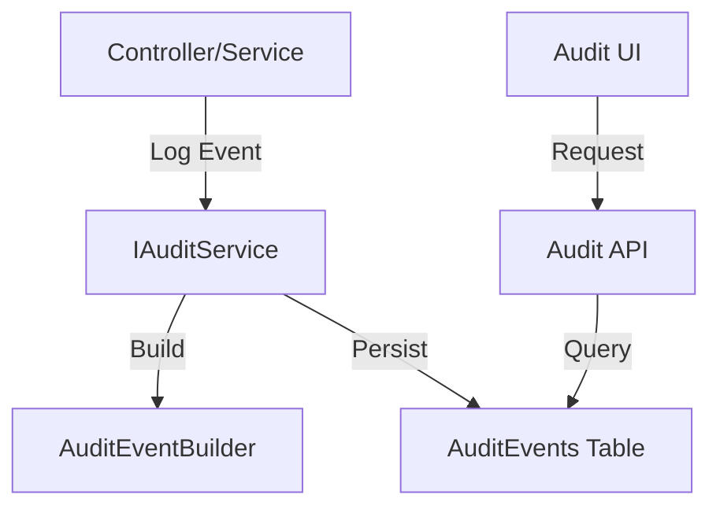

<!-- markdownlint-disable-next-line MD018 -->
#github-pull-request_copilot-coding-agent

> This issue is intended for the **Copilot Coding Agent** or a specific specialized agent (docs-agent, test-agent, lint-agent).  
> Please specify the agent if required. Otherwise, the default coding agent will be used.

---

## 1. Summary

Create comprehensive documentation for the audit logging system, including architecture, event catalog, development guide, and operations runbook.

---

## 2. Requirements

- Document the audit logging architecture and data model
- Provide a complete catalog of audited events
- Guide developers on adding new audit events
- Provide operational guidance for managing audit logs

---

## 3. Acceptance Criteria (Testable)

- [ ] Create `docs/audit/` directory structure
- [ ] Create `docs/audit/architecture.md` with:
  - Overview of audit logging system
  - Data model diagram (entity relationships)
  - Event capture flow diagram
  - Storage and indexing strategy
  - Retention and archival strategy
  - Integration points with application
- [ ] Create `docs/audit/events.md` with:
  - Comprehensive list of all audited actions organized by category:
    - User Management
    - Authentication
    - Authorization
    - Organization Management
    - Membership Management
    - Share Management
    - Proposal Lifecycle
    - Voting
    - Webhook Management
    - Admin Actions
  - For each event type:
    - ActionType and ResourceType values
    - Details structure (JSON schema)
    - Example event
  - Event categorization matrix
- [ ] Create `docs/audit/development.md` with:
  - How to add new audit events
  - AuditEventBuilder usage examples
  - Testing audit events
  - Common patterns and best practices
  - Troubleshooting guide
- [ ] Create `docs/audit/operations.md` with:
  - Retention configuration
  - Performance tuning recommendations
  - Query optimization tips
  - Monitoring and alerting recommendations
  - Backup and recovery considerations
  - Troubleshooting common issues
- [ ] Update `docs/architecture.md` with:
  - New section referencing audit documentation
  - Brief overview of audit capabilities
- [ ] Documentation follows existing style and formatting conventions

---

## 4. Constraints

- Documentation only—no production code changes
- Follow existing documentation patterns in `docs/`
- Use Mermaid for diagrams where appropriate
- Keep documentation accurate to implemented system

---

## 5. Technical Notes (Optional)

**Existing Documentation Style:**

Reference `docs/architecture.md` for formatting, heading structure, and diagram style.

**Architecture Diagram Example (Mermaid):**



**Event Documentation Template:**

```markdown
### User Created

- **ActionType:** `Created`
- **ResourceType:** `User`
- **Trigger:** User registration via `POST /users`

**Details Structure:**
```json
{
  "email": "user@example.com",
  "displayName": "John Doe",
  "role": "User"
}
```

**Example Event:**
```json
{
  "id": "...",
  "timestamp": "2024-01-15T10:30:00Z",
  "actorUserId": null,
  "actionType": "Created",
  "resourceType": "User",
  "resourceId": "abc-123",
  "resourceName": "John Doe",
  "details": { ... },
  "outcome": "Success"
}
```
```

**Related Stories:**

- Part of Epic E-005: Implement Thorough Audit Logging
- Should be written after core implementation is complete
- Supports: All future audit-related development

---

## 6. Desired Agent

Select one:

- [ ] **Default Coding Agent**
- [x] **docs-agent** (documentation only)
- [ ] **test-agent** (tests only)
- [ ] **lint-agent** (formatting / safe refactor only)
- [ ] **product-owner-agent** (idea → epic/story refinement; no code)

---

## 7. Files Allowed to Change

Allowed:
- docs/audit/**
- docs/architecture.md

---

## 8. Completion Criteria

When the agent submits a PR, it must include:

- Summary of all file changes
- Complete documentation covering all acceptance criteria
- Diagrams rendered correctly
- Cross-references between documents
- Updated main architecture doc
